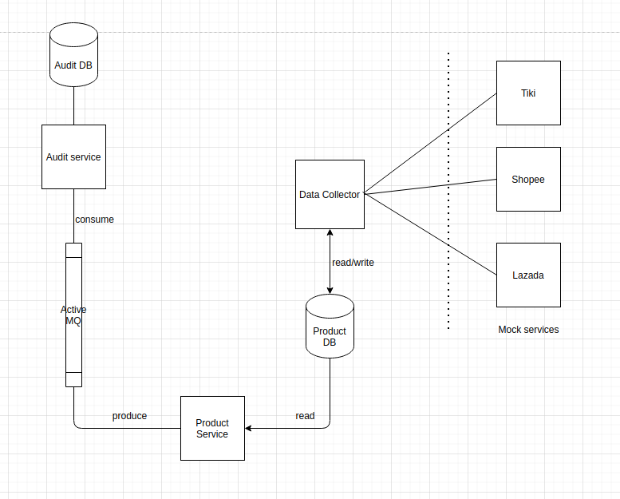
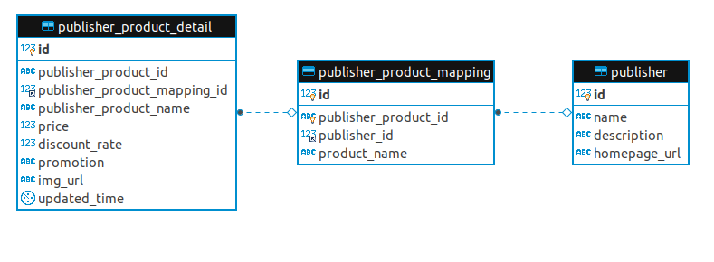

# NAB-SmartChoice-Assignment
Demo for Smart choice backend services

# Getting Started
## Prerequisites
To make it easier for launch the project, i have set up database / queue / mock services that ready for use using docker and docker-compose. Therefore, docker and docker-compose is needed.

Also, backend services written in java and using maven build tool. So java 8 and maven 3 is required.

## Installing
Navigate to root folder NAB-SmartChoice-Assignment and run (This might take up a minute to start all the container)

>. docker-compose up

After all container started successfully, navigate to data-collector folder and start the service either by maven or your favourite idea
Example running by maven:

>. cd data-collector

>. mvn clean install

>. java -jar target/data-collector-0.0.1-SNAPSHOT.jar

After data-collector start successfully, it will fetch the data from mock-service to database. Now start product-api and audit service (using same steps as data-collector above)

## Running the tests
#### CURL
Product API serve 2 basic API for searching and get detail of products.

Example:

>. curl --location --request GET 'localhost:8002/api/product?name=D%C3%A9p'

>. curl --location --request GET 'localhost:8002/api/product/2'

#### Unit Test
Unit test can run either by maven or your favourite idea

Example running by maven for data-collector:
>. cd data-collector

>. mvn clean test

## Architecture

For ease of developement, i'm using wiremock to set up mock service that acts as Tiki / Shopee / Lazada api (The response json is copied from real api)

### Data Collector
Service to collect data from publisher (Tiki / Shopee / Lazada). When start service, it will consume api from publisher, do some transformation and save it to mysql database.

This service using Spring Boot and Spring Batch framework.

### Product DB
Store detail of the product from publisher.

ER schema:

publisher table: store information of publisher

publisher product mapping: Mainly used to store product id in publisher site

publisher product detail: Store product detail

### Product API
Service to serve api for product

### Audit API
Service to store audit action

### Active MQ
Message queue to transfer audit event. Product API publish audit event and Audit API consume audit event.

